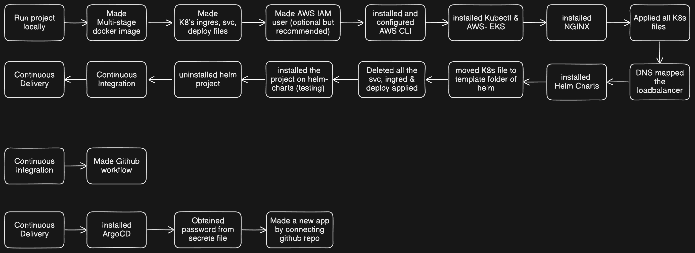

# DevOps-Powered Portfolio

[](https://github.com/ashrafxbilal/portfolio-devopsified/actions/workflows/ci.yaml)
[](https://github.com/ashrafxbilal/portfolio-devopsified)
[](https://github.com/ashrafxbilal/portfolio-devopsified)

A modern, cloud-native portfolio application built to showcase advanced DevOps practices and infrastructure automation. This project serves as a practical demonstration of a complete CI/CD pipeline, containerization, Kubernetes orchestration, infrastructure as code, and GitOps methodologies.

## 🏗️ Architecture Overview



## 🎯 Project Goals

- To demonstrate proficiency in modern DevOps practices including CI/CD, IaC, containerization, and GitOps.
- To build a reusable and scalable cloud-native architecture for deploying portfolio applications.
- To showcase expertise in Azure Cloud, Kubernetes (AKS), GitHub Actions, ArgoCD, Helm, and related technologies.

## 🚀 Key Features

- **Multi-Stage CI/CD Pipeline**: Automated build, test, and deployment workflow using GitHub Actions
- **Containerization**: Multi-stage Docker builds for optimized production images
- **Kubernetes Orchestration**: Declarative configuration with health checks and resource management
- **Infrastructure as Code**: Azure AKS cluster provisioned and managed with Terraform
- **GitOps Workflow**: ArgoCD for continuous deployment and configuration management
- **Helm Charts**: Templated Kubernetes manifests for consistent deployments
- **Ingress Configuration**: NGINX Ingress Controller with custom domain routing
- **Resource Optimization**: Container resource limits and requests for efficient scaling

## 🔒 Security Best Practices
- **Container Security**: Docker images scanned with Trivy for vulnerabilities before deployment
- **Access Control**: Kubernetes RBAC enforced for least privilege access to resources
- **Secret Management**: Secrets managed via Kubernetes secrets and Azure Key Vault integration
- **Dependency Management**: Automated dependency updates and vulnerability alerts via Dependabot
- **Network Security**: Network policies implemented to restrict pod-to-pod communication
- **Compliance**: Regular security audits and compliance checks against CIS benchmarks
- **Image Hardening**: Minimal base images with unnecessary packages removed

## 📂 Key Files & Documentation
- [CI Pipeline](.github/workflows/ci.yaml)
- [AKS Config](aks/cluster-config.md)
- [Helm Chart](helm/portfolio-devopsified-chart/)
- [ArgoCD Setup](gitops/argocd/install-argo.md)
- [NGINX Ingress Guide](ingress-controller/nginx/install-nginx-ing-controller.md)
- [Kubernetes Manifests](k8s/manifests/)

## 🛠️ Technology Stack
### Frontend
- React with TypeScript
- Tailwind CSS for styling

### DevOps & Infrastructure
- **Containerization**: Docker with multi-stage builds
- **Orchestration**: Kubernetes (AKS)
- **CI/CD**: GitHub Actions
- **GitOps**: ArgoCD
- **Package Management**: Helm
- **Infrastructure**: Azure Cloud (AKS)
- **Networking**: NGINX Ingress Controller, Azure DNS


## 📦 Containerization

### 🐳 Multi-Stage Docker Build

I've used a multi-stage Docker build to significantly reduce the final image size and improve security:

1. **Builder Stage** :
   
   - Uses node:20-alpine as the base image for building the application
   - Installs necessary build dependencies for canvas and other components
   - Builds the React application with optimizations enabled
   - Generates static assets and OpenGraph images

2. **Production Stage** :
   
   - Uses lightweight nginx:alpine as the final base image
   - Copies only the built artifacts from the builder stage
   - Configures NGINX for serving the SPA application
   - Reduces final image size by ~85% compared to a single-stage build

**This approach provides several benefits**:

- Smaller Image Size : Final production image is only ~25MB compared to ~200MB for a single-stage build
- Reduced Attack Surface : Build tools and dependencies are not included in the production image
- Faster Deployments : Smaller images pull faster and start quicker
- Better Security : Minimal components in the production image means fewer potential vulnerabilities

## 🚢 Kubernetes Manifests

This has been deployed using Kubernetes manifests with the following components:

### Deployment
- Uses declarative configuration with 2 replicas for high availability
- Implements resource requests and limits to ensure efficient resource utilization
- Configures liveness and readiness probes for self-healing capabilities
- Uses rolling update strategy for zero-downtime deployments

### Service
- Exposes the application internally using a ClusterIP service
- Configures proper selectors to match deployment pods
- Sets up appropriate ports for the application

### Ingress
- Configures routing rules for external access
- Uses annotations for NGINX Ingress Controller customization
- Sets up TLS for secure HTTPS connections
- Defines host-based routing for domain access

## 🌐 Deployment Architecture

The application is deployed on Azure Kubernetes Service (AKS) with the following components:

- **AKS Cluster**: 2-node cluster with autoscaling (1-3 nodes)
- **Deployment**: 2 replicas with resource limits and health probes
- **Service**: ClusterIP service exposing port 80
- **Ingress**: NGINX Ingress Controller with custom domain routing
- **DNS**: Azure DNS zone configuration for domain management

## 🔄 CI/CD Pipeline

The project implements a robust CI/CD pipeline with the following stages:

1. **Build & Test**: Compiles the application and runs automated tests
2. **Code Quality**: Performs linting and formatting checks
3. **Docker Build**: Creates optimized container images
4. **Image Push**: Publishes images to Docker Hub with semantic versioning and tags it with last 4 digits of github run id.
5. **Helm Chart Update**: Updates deployment configuration with new image tags
6. **GitOps Sync**: ArgoCD detects changes and automatically deploys to Kubernetes

## 📊 Monitoring & Observability

- Kubernetes-native health probes (liveness and readiness)
- Resource utilization monitoring via Azure Monitor
- Centralized logging with Azure Log Analytics

## 🚢 Deployment Instructions

### Prerequisites

- Azure CLI (v2.40.0+)
- kubectl (v1.25.0+)
- Helm (v3.10.0+)
- Docker (v20.10.0+)
- A valid Azure subscription
- Domain name (for production deployments)

### Environment Setup

```bash
# Create .env file with required configuration
cat > .env << EOF
# Azure Configuration
AZURE_SUBSCRIPTION_ID=your-subscription-id
AZURE_TENANT_ID=your-tenant-id
AZURE_LOCATION=eastus

# Kubernetes Configuration
CLUSTER_NAME=portfolioCluster
RESOURCE_GROUP=portfolio-rg
NODE_COUNT=2
NODE_VM_SIZE=Standard_B2s
MIN_COUNT=1
MAX_COUNT=3

# Application Configuration
APP_NAME=portfolio
DOMAIN_NAME=yourdomain.com
EOF
```

### Deploying to AKS

1. **Login to Azure and Set Subscription**:
   ```bash
   az login
   az account set --subscription $AZURE_SUBSCRIPTION_ID
   ```

2. **Create AKS Cluster**:
   ```bash
   az group create --name $RESOURCE_GROUP --location $AZURE_LOCATION
   az aks create \
     --resource-group $RESOURCE_GROUP \
     --name $CLUSTER_NAME \
     --node-count $NODE_COUNT \
     --node-vm-size $NODE_VM_SIZE \
     --enable-cluster-autoscaler \
     --min-count $MIN_COUNT \
     --max-count $MAX_COUNT \
     --enable-managed-identity \
     --enable-addons monitoring \
     --generate-ssh-keys
   ```

3. **Configure kubectl**:
   ```bash
   az aks get-credentials --resource-group $RESOURCE_GROUP --name $CLUSTER_NAME
   kubectl cluster-info
   ```

4. **Deploy with Helm**:
   ```bash
   # Update Helm chart values if needed
   helm upgrade --install $APP_NAME ./helm/portfolio-devopsified-chart \
     --set image.tag=latest \
     --set ingress.host=$DOMAIN_NAME \
     --set replicaCount=2 \
     --wait
   ```

5. **Install NGINX Ingress Controller**:
   ```bash
   kubectl apply -f https://raw.githubusercontent.com/kubernetes/ingress-nginx/controller-v1.12.1/deploy/static/provider/cloud/deploy.yaml
   kubectl wait --namespace ingress-nginx \
     --for=condition=ready pod \
     --selector=app.kubernetes.io/component=controller \
     --timeout=120s
   ```

6. **Configure DNS**:
   ```bash
   # Get Ingress IP
   INGRESS_IP=$(kubectl get service ingress-nginx-controller -n ingress-nginx -o jsonpath='{.status.loadBalancer.ingress[0].ip}')
   
   # Create DNS records (Azure DNS)
   az network dns record-set a add-record \
     --resource-group $RESOURCE_GROUP \
     --zone-name $DOMAIN_NAME \
     --record-set-name "@" \
     --ipv4-address $INGRESS_IP
   ```

7. **Verify Deployment**:
   ```bash
   kubectl get pods,svc,ingress
   curl -H "Host: $DOMAIN_NAME" http://$INGRESS_IP
   ```


## 🤝 Contributing

Contributions are welcome! Please feel free to open an issue or submit a pull request if you have suggestions or improvements.

## 🔍 Future Enhancements

- **Advanced Monitoring**: Implement Prometheus and Grafana for comprehensive metrics collection and visualization
- **Service Mesh**: Add Istio service mesh for enhanced traffic management, security, and observability
- **Infrastructure Automation**: Implement Terraform modules for infrastructure provisioning with state management
- **Security Automation**: Set up automated security scanning with Trivy integrated into CI/CD pipeline
- **Cost Optimization**: Implement Kubernetes cost optimization tools like Kubecost
- **Chaos Engineering**: Add chaos testing with Chaos Mesh to improve resilience
- **GitOps Expansion**: Extend GitOps practices to infrastructure with Crossplane

### 🔒 Security Best Practices
- **Container Security**: Docker images scanned with Trivy for vulnerabilities before deployment
- **Access Control**: Kubernetes RBAC enforced for least privilege access to resources
- **Secret Management**: Secrets managed via Kubernetes secrets and Azure Key Vault integration
- **Dependency Management**: Automated dependency updates and vulnerability alerts via Dependabot
- **Network Security**: Network policies implemented to restrict pod-to-pod communication
- **Compliance**: Regular security audits and compliance checks against CIS benchmarks
- **Image Hardening**: Minimal base images with unnecessary packages removed


*This project was created by Bilal Ashraf as a demonstration of DevOps engineering skills and best practices.*